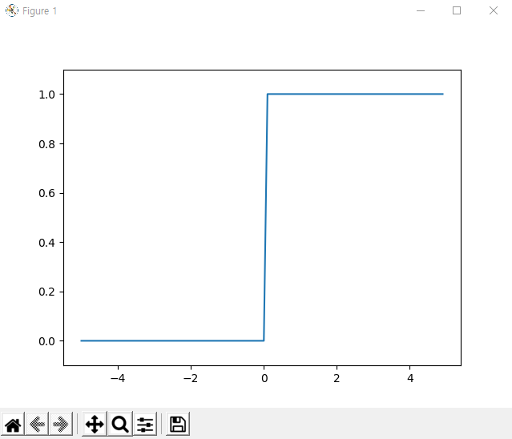
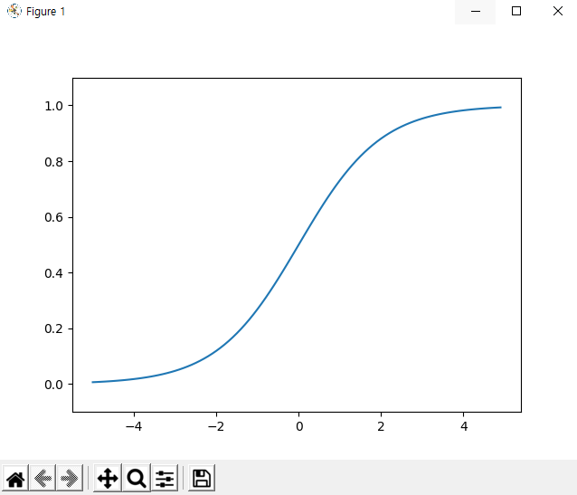
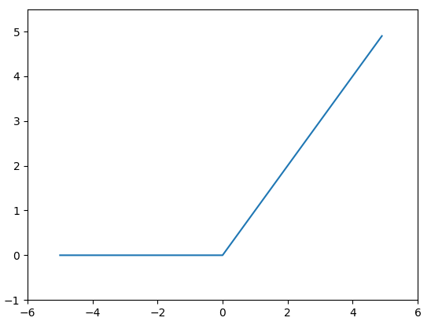

# 신경망(Network)

- 가중치 매개변수의 적절한 값을 데이터로부터 자동으로 학습하는 능력이 바로 신경망의 성질!
- 신경망은 입력층, 은닉층, 출력층으로 나뉨!

 

        [은닉층]
        입력층, 출력층과 달리 사람에게 보이지 않음!

 
 

> ## 01. 활성화함수(activation function)

 

- 입력신호의 총합이 활성화를 일으키는지 정하는 역할!
- 입력신호의 총합을 출력신호로 변환하는 함수
- 활성화함수는 은닉층에서 h(a), 출력층에서 σ(a) - 시그마sigma 로 나타냄
- 그래서 기존의 퍼셉트론에서 가중치를 곱한 값과 편향을 모두 더하는 것을 a단계(계산단계)로 함.
- 이후 이 a를 활성화함수에 넣어 출력(y)를 보는 것이 흐름.
- 출력층의 활성화 함수는 풀고자 하는 문제에 따라 다르게 설정.
- 회귀 문제에서는 항등함수, two-class-classification에서는 시그모이드, multi-class-classification에서는 소프트맥스가 일반적

 

- 기존의 임계값 기준으로 출력이 바뀌는 함수를 "계단함수(step function)"라고 함.
- 그래서 퍼셉트론은 활성화함수로 "계단함수"를 이용한다고 말할 수 있음.

 

        계단함수 그래프

 

        [시그모이드 함수(sigmoid function)]
        h(x) = 1 / (1 + exp(-x))

        * exp(-x) = e^(-x)
        * e = 자연상수 (2.7182 ...)
        * 자연상수의 의미 : 자연의 연속성장을 표현하기 위한 상수
        * 100%의 성장률을 가지고 1회 연속 성장할 때 얻게 되는 성장량
        * e^x에서 지수 x의 의미 : 성장횟수*성장률

        시그모이드함수 그래프

 

        [계단함수와 시그모이드함수의 비교]
        - 시그모이드 함수는 '매끄럽다'
        - 계단 함수는 임계점을 기점으로 0 또는 1로 출력이 고정
        - 시그모이드 함수는 0.23, 0.9 등 출력이 연속적
        - 두 함수 모두 0과 1사이의 출력을 가지는 공통점이 있음
        - 두 함수 모두 비선형 함수임

 

        [렐루(ReLU : Rectified Linear Unit)함수]
        - 입력이 0을 넘으면 입력을 그대로 출력
        - 0 이하면 0을 출력

        렐루함수 그래프

   

> #### [C.f.01.] 자연로그(ln)의 의미 : 어떤 성장량을 알고 있을 때, 성장 횟수와 성장률을 곱한 값을 역으로 계산해낼 수 있는 수학적 기술 (참고 : https://angeloyeo.github.io/2019/09/04/natural_number_e.html)
>
> 👉 ln(e^x) = x = 성장횟수\*성장률
