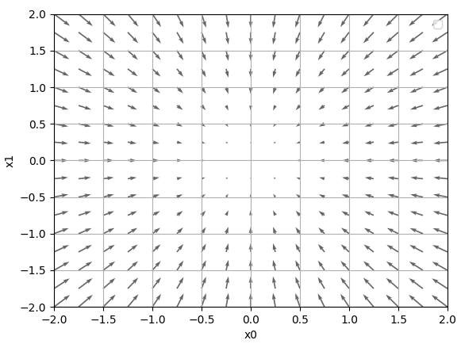
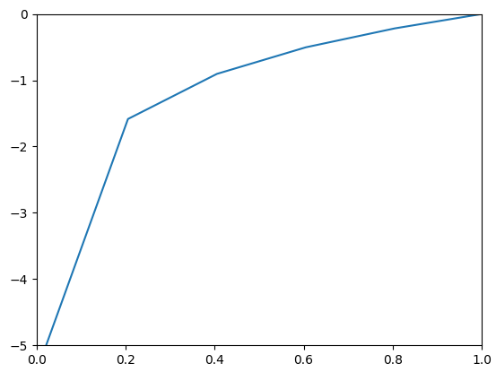

# 신경망 학습

- 학습이란, 훈련 데이터로부터 가중치 매개변수의 최적값을 자동으로 획득하는 것!
- 손실함수 : 신경망이 학습할 수 있도록 해주는 지표
- 손실 함수의 결괏값을 가장 작게 만드는 가중치 매개변수를 찾는 것이 학습의 목표!

 

        [데이터 주도 학습]
        * 데이터에서 답을 찾고, 패턴을 발견하는 것이 바로 기계학습!
        * 주어진 데이터의 특징(feature)을 추출하고, 그 패턴을 기계학습 기술로 학습
        * 특징(Feature)은 입력 데이터에서 중요한 데이터를 정확히 추출하도록 설계된 변환기

 

        [신경망(딥러닝)]
        * 신경망은 데이터를 있는 그대로 학습, 특징까지도 스스로 학습!
        * 종단간 기계학습(end to end machine learning)이라고도 함!

 

        [훈련 데이터와 시험 데이터]
        * 훈련 데이터(training data) : 학습용 데이터 - 최적의 매개변수를 찾음
        * 시험 데이터(test data) : 훈련한 모델의 실력을 평가 (범용 능력)
        * 오버피팅(overfitting) : 특정 데이터셋에만 성능을 보이도록 지나치게 최적화된 상태

 

        [손실함수(loss function)]
        * 신경망 성능의 '나쁨'을 나타내는 지표 (훈련 데이터를 처리하지 못하는 비율)
        * 일반적으로 오차제곱합과 교차 엔트로피 오차를 사용
        * 신경망에서 손실함수의 값을 작게 하는 최적의 매개변수를 찾아나가는 과정을, 매개변수 미분(기울기)을 계산하고, 그것을 갱신하는 과정을 반복함
        * 손실값이 아닌 정확도를 지표로 삼는다면, 미분 과정에서 대부분이 0이 되므로 매개변수 갱신이 안 되기 때문에 손실함수를 사용

 

        [오차제곱합(Sum of Squares for Error, SSE)]
        * E = (0.5) * [각 차원에서 (신경망 출력 - 정답 레이블)의 제곱들의 총합]

 

        [교차 엔트로피 오차(Cross Entropy Error, CEE)]
        * E = (-1) * [(k가 정답인 one-hot-coding 정답테이블) * (자연로그 : k를 정답으로 추론하는 테이블)]

 

        [미니배치(mini-batch)]
        * 훈련 데이터 전체에 대한 손실함수를 구하려면 매우 오래 걸릴 수 있음
        * 이런 경우 데이터 일부를 추려, 전체의 '근사치'로 이용하는 것을 미니배치라고 함

 

        [수치 미분(numerical differentiation)]
        * 미분은 어느 순간의 변화량(속도)를 나타냄.
        * 미분 = (f(x+h) - f(x)) / h(순간), 즉 다음 순간과 이번의 결과값을 뺀 값, 변화량을 그 순간 시간으로 나눈 것, 그리고 그 시간을 한없이 0에 가깝게 하는 것을 말함
        * 그러나 미분을 파이썬에 적용할 때, 두가지 문제가 있음
        1. h에 작은 값을 넣으려고 가능한 작은 값(예를 들어 10e-50)을 넣는 경우, 반올림 오차(rounding error)가 발생 - 10^(-4)정도가 적당
        2. 차분(f(x+h)-f(x), 두 함수의 차)은 오차가 존재 - 미분은 기울기를 의미하기 때문에, 엄밀히는 차이가 있음. 그래서 근삿값을 구해서 계산하는 것이 수치 미분.
        * x를 중심으로 h 전후를 계산한다는 의미에서 중심차분 또는 중앙차분이 있음.

 

        [편미분(Partial derivative)]
        * 변수가 여럿인 함수에 대한 미분
        * 목표 변수를 놔두고 나머지 변수를 특정 값으로 값을 고정하여 값을 구함!

 

        [기울기(gradient)]
        * 모든 변수의 편미분을 벡터로 정리한 것
        * 기울기 방향벡터는 각 장소에서 함수의 출력 값을 가장 크게 줄이는 방향을 나타냄!
        * 복잡한 함수에서는 기울기가 가리키는 방향에 최솟값이 없는 경우가 많음. (그러나 그 방향이 함수의 값을 줄이는 것은 팩트)
        * 기울기가 0이 되는 곳이 목표지점이지만, 이 지점이 극솟값(한정 범위에서 최솟값)/최솟값/안장점(방향에 따라 극댓값 or 극솟값) 중 하나이므로, 반드시 최솟값이지 않으며, 또한 주변이 전체적으로 평평한 모양의 고원(정체기)에 빠질 수도 있음

 

        [경사법 / 경사 하강법]
        * 기울기를 잘 이용해 함수의 최솟값(또는 가능한 한 작은 값)을 찾는 것이 경사법
        * 기계학습을 최적화하는 데 흔히 쓰이는 방법
        * 최소값을 찾는 경우를 경사 하강법, 최댓값을 찾으면 경사 상승법 - 주로 하강법을 씀 (부호 차이라 차이는 중요하지 않음)

 

        [학습률(learning rate)]
        * 기호로 에타(η)
        * 갱신하는 양을 나타냄
        * 한 번의 학습으로 얼만큼 학습해야 할지, 매개변수 값이 얼마나 갱신될지 결정하는 것

   

> #### [C.f.01.] 퍼셉트론에서 보였던 직선으로 분리가능한 문제는 유한 번의 학습을 통해 학습할 수 있다는 것이 증명됨 (Perceptron convergence theorem - 퍼셉트론 수렴 정리)

> #### [C.f.02.] 비선형 분리문제는 자동으로 학습할 수 없음

> #### [C.f.03.] 자연로그는 아래 그래프처럼 x가 1일때 y가 0이 되고, x가 0에 가까워질수록 y의 값이 점점 작아짐. 즉, 정답일 때의 출력이 작아질수록 오차가 커짐
>
> 
